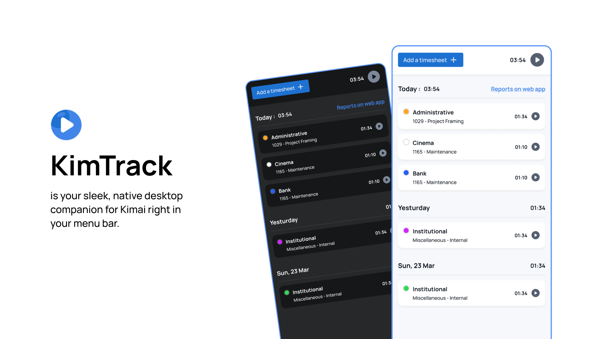

# KimTrack

KimTrack is a native desktop companion for [Kimai](https://www.kimai.org/) that lives in your menu bar—offering one-click start/stop, intelligent idle detection, and cross-platform support (Windows, macOS & Linux). Effortless time tracking without ever leaving your workflow.

🔗 [Get a license on Kimai Store](https://store.kimai.org/store/playmoweb-kimtrack.html)

---

## Releases

All official releases are hosted on GitHub:

🔗 [App Releases](https://github.com/playmoweb/kimtrack/releases)

---

## Support

If you encounter any problems, have questions, or would like to suggest a feature, please open an issue on GitHub:

🔗 [Report an issue](https://github.com/playmoweb/kimtrack/issues)
